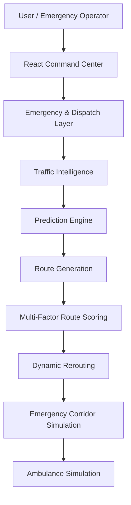

# 🚨 Smart City Command Center

### AI-Assisted Urban Traffic & Emergency Response System

Turning changing city conditions into faster, safer emergency routing decisions.

## 🌐 Live Demo

Frontend:
https://life-line-ai-frontend-alpha.vercel.app/

Backend:
https://innovators-conclave-2k26-team-verte.vercel.app/

*Software-only hackathon prototype with simulated emergency traffic conditions.*

## 1. THE PROBLEM

During an emergency, simply finding the shortest route is not enough.

Traffic conditions change rapidly. Accidents create unexpected delays, road blockages affect route reliability, and congestion can worsen while an ambulance is actively moving.

Traditional navigation systems focus mainly on route distance and a static ETA at the time of departure.

**Emergency response needs continuous decision-making** to adapt to the reality of the road.

## 2. OUR SOLUTION

Smart City Command Center is an AI-assisted emergency traffic decision-support platform. It continuously evaluates changing conditions rather than selecting a route just once.

**Core flow:**

Emergency 
↓ 
Traffic Intelligence 
↓ 
Traffic Prediction 
↓ 
Incident Detection 
↓ 
Multi-Factor Route Scoring 
↓ 
Dynamic Rerouting 
↓ 
Simulated Emergency Green Corridor 
↓ 
Ambulance Completion

## 3. KEY FEATURES

| Feature | What it does | Why it matters |
|---------|--------------|----------------|
| **1. Emergency Creation** | Instantly drop an emergency pin on the map. | Faster response initiation. |
| **2. Ambulance Dispatch** | Selects and dispatches the most suitable ambulance unit. | Ensures the right equipment arrives. |
| **3. Multi-Route Generation** | Generates Recommended, Alternative, and Backup routes. | Provides options for operator override. |
| **4. AI Route Intelligence** | Scores routes beyond just distance using multiple dynamic factors. | Avoids gridlocks and risky paths. |
| **5. Current Traffic Analysis** | Normalizes real-time traffic data into usable metrics. | Provides ground-truth visibility. |
| **6. Predictive Traffic Intelligence** | Estimates near-future congestion using historical trends. | Prevents driving into forming bottlenecks. |
| **7. Incident Management** | Detects and incorporates unexpected accidents into routing. | Adapts to sudden road closures. |
| **8. Dynamic Rerouting** | Reevaluates the active route mid-journey if conditions worsen. | Saves critical minutes during transit. |
| **9. Emergency Green Corridor Simulation** | Virtual intersection priority clearance simulation. | Prepares the path ahead of the ambulance. |
| **10. Ambulance Movement Simulation** | Visualizes the ambulance traveling along the road network. | Provides continuous location tracking. |
| **11. Command Center Dashboard** | Unified interface for operators to monitor emergencies. | Enhances situational awareness. |
| **12. Judge Demo Mode** | Automated sequence to quickly showcase core platform features. | Perfect for rapid hackathon judging. |
| **13. Live Explain / Manual Demo** | Step-by-step interactive mode for deep technical review. | Demonstrates robust system functionality. |
| **14. Failure Fallback** | Maintains operations during external API or OSM outages. | Ensures system reliability. |
| **15. Operational Analytics** | Tracks metrics like average response time and route efficiency. | Enables post-incident evaluation. |

## 4. WHAT MAKES IT DIFFERENT

The system does not choose a route using distance alone.

Route scoring considers:
- ETA
- Current traffic
- Predicted traffic
- Incident impact
- Distance
- Reliability

Routes receive a score and are categorized as:
- **RECOMMENDED**
- **ALTERNATIVE**
- **BACKUP**

*Note: These scores serve as AI-assisted recommendations and decision support, not guaranteed mathematically optimal routes.*

## 5. AI / INTELLIGENCE

### 1. Traffic Intelligence
Normalizes traffic into:
- Intensity
- Congestion score
- Severity
- Source
- Timestamp

### 2. Predictive Traffic Intelligence
Uses recent traffic states and trend-based linear regression to estimate near-future congestion.
*(Current traffic → historical session states → trend → predicted congestion)*

### 3. Multi-Factor Route Scoring
Evaluates and ranks routes based on ETA, current traffic, predicted traffic, incident impact, distance, and historical reliability.

### 4. Dynamic Rerouting
The system periodically reevaluates the active route and can switch only when improvement is significant enough, featuring anti-oscillation protection / cooldown to prevent erratic rerouting.

## 6. EMERGENCY GREEN CORRIDOR

The project simulates emergency signal priority using virtual intersections along the active ambulance route.

States:
- **PREPARING**
- **PRIORITY**
- **CLEARED**

*This is a software simulation for the hackathon prototype and does not directly control physical traffic signals.*

**Future real-world integration would involve:**
- Traffic signal controllers
- IoT infrastructure
- City traffic APIs
- Emergency services integration

## 7. SYSTEM ARCHITECTURE

**Backend:** Node.js + Express  
**External/Supporting services:** Routing APIs, Traffic data when available, OpenStreetMap / Overpass where applicable  
**Fallback:** Deterministic simulation  

## 8. TECH STACK

| Layer | Technology | Purpose |
|-------|------------|---------|
| **Frontend** | React, Vite, Tailwind CSS, Leaflet / React Leaflet | Interactive, high-performance UI and mapping |
| **Backend** | Node.js, Express | API Gateway and OSM Proxy |
| **Intelligence** | JavaScript, SimpleLinearRegression, Rule-based multi-factor scoring | Traffic normalization, trend prediction, route ranking |
| **Maps** | Leaflet, OpenStreetMap, Routing APIs | Geospatial rendering and route geometry |
| **Deployment** | Vercel | Scalable frontend and backend hosting |

## 9. DATA & STORAGE

Current hackathon prototype uses runtime application state and simulated/proxy operational data for the live demonstration. Persistent database storage is not currently enabled.

**Production Architecture (Future):**
PostgreSQL could persist:
- Emergency records
- Ambulance trips
- Route history
- Traffic history
- Incidents
- Prediction history
- Analytics

## 10. DEMO WALKTHROUGH

1. Create emergency
2. Dispatch ambulance
3. Generate routes
4. Show route scores
5. Select recommended route
6. Start ambulance movement
7. Trigger traffic spike
8. Show prediction
9. Create incident
10. Trigger dynamic rerouting
11. Show new corridor
12. Show ambulance continuing
13. Open analytics
14. Reset

## 11. FAILURE HANDLING

The system has robust fallback behavior for external routing/traffic failures:
- API failure fallback
- Invalid response handling
- Reroute failure recovery
- Ambulance movement continuity
- Reset functionality
- Error-safe simulation

## 12. SCREENS / FEATURE SHOWCASE

### Command Center Dashboard

- **What the judge is seeing**: The main situational awareness map with dispatched units, routing options, and ongoing incident markers.
- **What the feature does**: Aggregates all emergency data into a single operational view.
- **Why it matters**: Gives operators complete visibility without switching screens.

*(Note: Additional UI features are best experienced directly in the Live Demo.)*

## 13. PROJECT WORKFLOW

Emergency Created
→ Ambulance Dispatched
→ Routes Generated
→ Routes Scored
→ Route Recommended
→ Ambulance Moving
→ Traffic Changes
→ Prediction Generated
→ Incident Detected
→ Route Reevaluated
→ Reroute if required
→ Emergency Corridor Updated
→ Ambulance Completes

## 14. WHY SOFTWARE-ONLY

The hackathon prototype intentionally demonstrates the intelligence and decision-making layer without requiring physical IoT hardware.

**Advantages:**
- Fast demonstration
- Reproducible simulation
- Safe testing
- Easy deployment
- Hardware-independent validation

Future integration can connect the decision layer to real traffic infrastructure.

## 15. REAL-WORLD SCALABILITY

**FUTURE / PRODUCTION architecture:**  
Real-time traffic feeds
+ Emergency service APIs
+ GPS ambulance tracking
+ Historical traffic database
+ ML prediction models
+ City traffic signal APIs
+ IoT signal controllers
+ Cloud infrastructure

## 16. LIMITATIONS

- Current traffic simulation is not a replacement for city-wide real-time traffic infrastructure.
- Prediction is trend-based.
- Emergency corridor is simulated.
- Ambulance movement is simulated.
- Persistent database is not currently enabled.
- External API availability can affect live routing.

## 17. FUTURE SCOPE

- PostgreSQL persistence
- Real-time GPS tracking
- Historical traffic datasets
- Stronger ML models
- Real-time city traffic APIs
- IoT signal integration
- Emergency service integration
- Role-based command center access
- City-wide analytics
- Multi-ambulance optimization
- Predictive incident detection

## 18. IMPACT

- Faster emergency route decisions
- Continuous route evaluation
- Better visibility for operators
- Incident-aware routing
- Predictive traffic awareness
- Foundation for smart-city emergency coordination

## 19. TEAM

Team Vertex

## 20. LICENSE

This project is licensed under the MIT License — see the LICENSE file for details.
